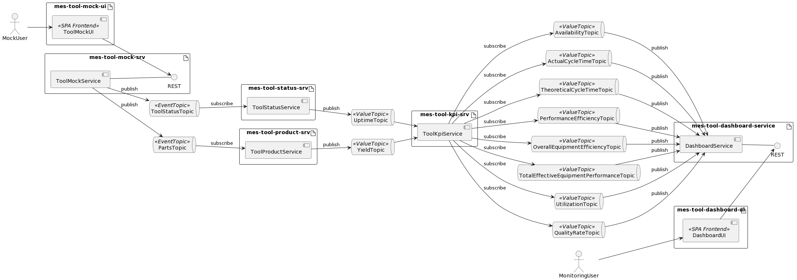

# mes-tool-status-srv
A microservice to process tool status events

ToolStarted --> post UT increment to UT value topic

ToolStopped(Reason) --> post DT increment to DT value topic

## Fit Into Overall Architecture

* 
* 
* 
* 
